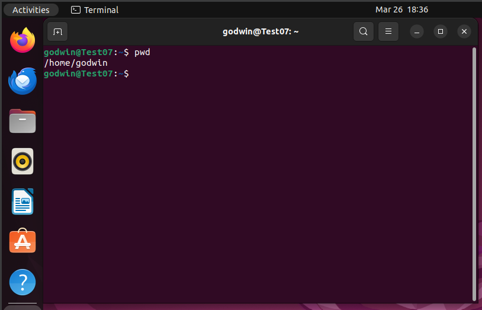
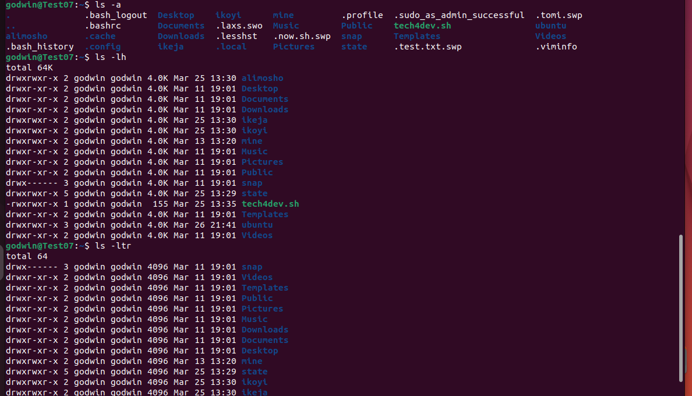
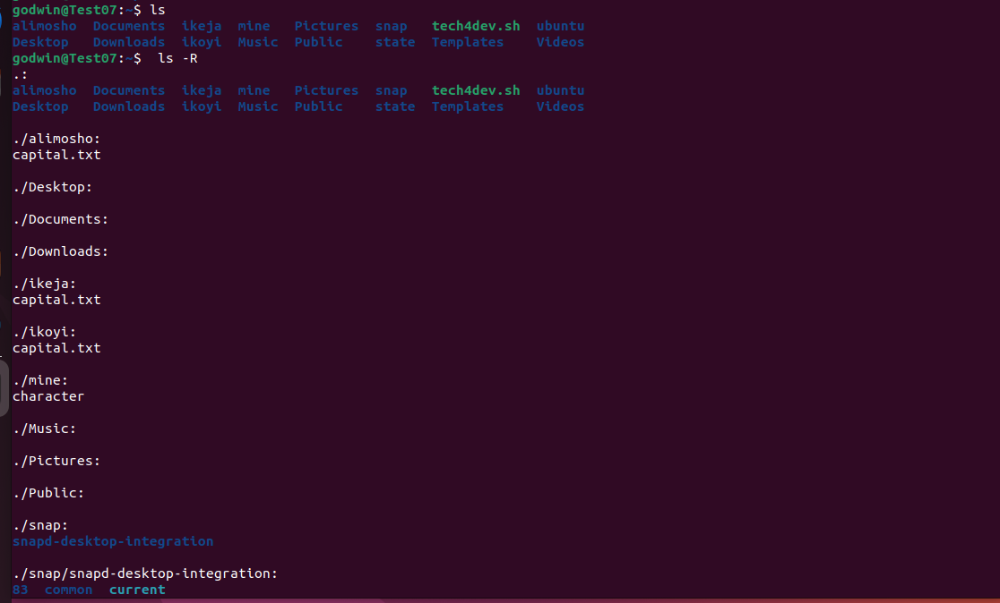
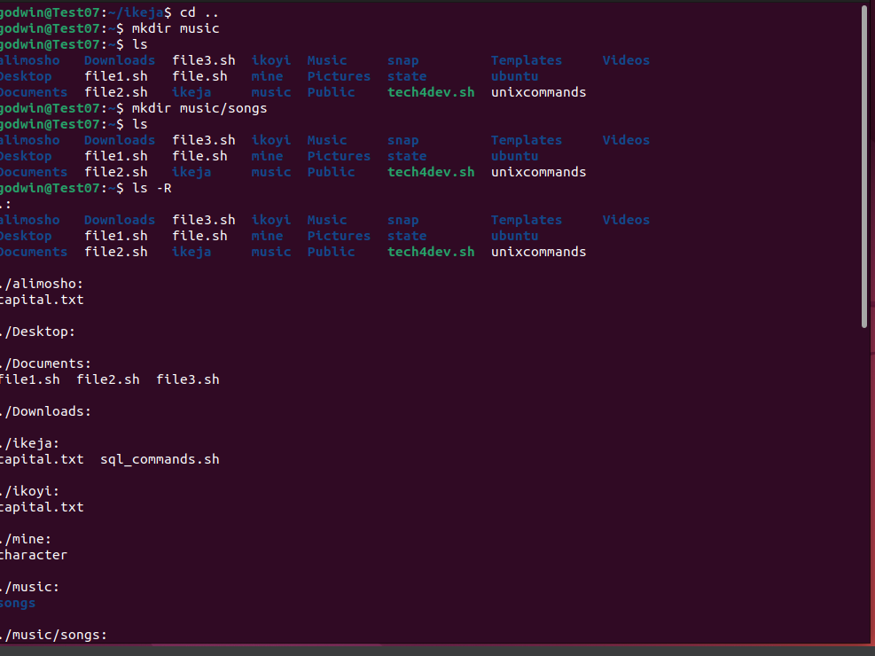

# `sudo apt upgrade`

## sudo apt upgrade is a command-line utility for installing, updating, removing, and otherwise managing deb packages on Ubuntu, Debian, and related Linux distributions. It combines the most frequently used commands from the apt-get and apt-cache tools with different default values of some options.

# `pwd`

 ## "pwd" simply means print working directory, it allows one view the current directory.  It prints the path of the working directory, starting from the root. pwd is shell built-in command(pwd) or an actual binary(/bin/pwd). $PWD is an environment variable that stores the path of the current directory

# `cd`

## The cd (“change directory”) command is used to change the current working directory in Linux and other Unix-like operating systems. It is one of the most basic and frequently used commands when working on the Linux terminal. The current working directory is the directory (folder) in which the user is currently working in. Each time you interact with your command prompt, you are working within a directory. In order to execute the command in the scrrenshot below, i had to create the ubuntu and commandslinux directory first on my ubuntu terminal

# `ls`

## The ls command lists files and directories within the file system, and shows detailed information about them. It is a part of the GNU core utilities package which is installed on all Linux distributions. The ls command has a lot of syntax like ls-a, ls-lh, ls-R, ls-ltr etc which all have different functions and meanings.

# `cat`

## The cat command is one of the most widely used commands in Linux. The name of the cat command comes from its functionality to concatenate files. It can read, concatenate, and write file contents to the standard output. If no file is specified or the input file name is specified as a single hyphen (-), it reads from the standard input. Cat is most commonly used to display the contents of one or multiple text files, combine files by appending one file’s contents to the end of another file, and create new files. To run the command in the snapshot we need to create a file name tech4dev.sh on my linux terminal.

# `cp`

## The cp is a command-line utility for copying files and directories on Unix and Linux systems.There are different syntax to cp command,we have cp -R, etc.

# `mv`

##  The mv command has 2 major function:moving files and renaming files. The mv command (short from move) is used to rename and move and files and directories from one location to another. The syntax for the mv command is as follows: mv [OPTIONS] SOURCE DESTINATION

# `mkdir`

## The "mkdir" command is to make directories, To create a directory in Linux, pass the directory’s name as the argument to the mkdir command. For example, to create a new directory newdir, you would run the following command: "mkdir newdir"

# `rmdir`

## The "rmdir" command is to use delete folders in Linux command line.

# `rm`

## The "rm" command is used to remove objects such as files, directories, symbolic links and so on from the file system like UNIX. To be more precise, rm removes references to objects from the filesystem, where those objects might have had multiple references (for example, a file with two different names). By default, it does not remove directories. This command normally works silently and you should be very careful while running rm command because once you delete the files then you are not able to recover the contents of file.

# `touch`

## The touch command is a standard command used in the UNIX/Linux operating system which is used to create, change and modify the timestamps of a file. This command can be used when the user doesn’t have data to store at the time of file creation.

# `locate`

## Locate command in Linux is used to find the files by name. There are two most widely used file-searching utilities accessible to users called to find and locate. The locate utility works better and faster than the find command counterpart because instead of searching the file system when a file search is initiated, it would look through a database. To locate a file, you need to run the command locate "filename". The command wasn't working so i had to run the command "sudo apt install plocate" first 

# `find`

## The "find" command in Linux is a dynamic utility designed for comprehensive file and directory searches within a hierarchical structure. Its adaptability allows users to search by name, size, modification time, or content, providing a flexible and potent solution.

# `grep`

## "grep" is a command-line utility that searches for a specific text string in one or more files. It looks for the pattern in each line of the file and prints out the lines that match it. It is a powerful tool for searching and analyzing large amounts of text data quickly and efficiently

# `df`

## The df command is used to get a detailed report on the system’s disk space usage. To display information about disk drives in human-readable format (kilobytes, megabytes, gigabytes and so on), invoke the df command with the -h option

# `du` command 

## du command short for “disk usage” reports the estimated amount of disk space used by given files or directories. It is practically useful for finding files and directories taking up large amounts of disk space.

# `head`

## "head" command The head command does the opposite of what the tail command does. It shows the starting content of a file, while the tail command prints the ending lines of a file. By default, head displays the first 10 lines. If you want to print more or less than 10 lines, just use the -n option. Similarly, the -c option with the head command can restrict the output to a particular byte number. The head command can analyze logs and other text files that are subject to vary over time. You can use the head command in conjunction with other commands for selective, real-time monitoring.

# `tail`

## tail command is the complementary of head command. The tail command, as the name implies, prints the last N number of data of the given input. By default, it prints the last 10 lines of the specified files. If more than one file name is provided then data from each file is preceded by its file name.

# `diff`

## "diff" command is used to compare files, line by line and it is crucial for identifying differences, debugging code, and ensuring the integrity of data.

# `tar`

## tar command stands for tape archive, which is used to create Archive and extract the Archive files. tar command in Linux is one of the important commands that provides archiving functionality in Linux. We can use the Linux tar command to create compressed or uncompressed Archive files and also maintain and modify them.

# `chmod`

# The `chmod` command is used to modify this permission so that it can grant or restrict access to directories and files.  The name is an abbreviation of change mode. Which states that every file and directory has a set of permissions that control the permissions like who can read, write or execute the file. In this the permissions have three categories: read, write, and execute simultaneously represented by `r`, `w` and `x`. These letters combine together to form a specific permission for a group of users.

# `chown`

## The `chown` command, short for “change owner,” is a powerful tool that allows users to change the owner of files and directories. This command is particularly useful in scenarios where administrators need to grant or revoke access to specific resources.

# `jobs`

##  Jobs command is used to list the jobs that you are running in the background and in the foreground. If the prompt is returned with no information no jobs are present. All shells are not capable of running this command. 

# `kill`

## kill command in Linux (located in /bin/kill), is a built-in command which is used to terminate processes manually. kill command sends a signal to a process that terminates the process. If the user doesn’t specify any signal that is to be sent along with the kill command, then a default TERM signal is sent that terminates the process.

# `ping`

## The ping (Packet Internet Groper) command is used to check the network connectivity between the host and server/host. This command takes as input the IP address or the URL and sends a data packet to the specified address with the message “PING” and gets a response from the server/host this time is recorded which is called latency. Fast ping with low latency means a faster connection. Ping uses ICMP(Internet Control Message Protocol) to send an ICMP echo message to the specified host if that host is available then it sends an ICMP reply message. Ping is generally measured in milliseconds every modern operating system has this ping pre-installed.

# `wget`

## wget is a command-line utility for downloading files from the web. With Wget, you can download files using HTTP, HTTPS, and FTP protocols. Wget provides a number of options allowing you to download multiple files, resume downloads, limit the bandwidth, recursive downloads, download in the background, mirror a website, and much more.

#

# `uname`

## The uname (derived from "UNIX name") is a simple command that you can run without any special permission to output basic information about the operating system and hardware platform of your Linux computer. For example, You can use the uname command for troubleshooting, checking system upgrades, scripting, and monitoring purposes. You can also check the kernel release details, Linux kernel version, and hardware architecture (32-bit or 64-bit).

# `top`

## top command is used to show the Linux processes. It provides a dynamic real-time view of the running system. Usually, this command shows the summary information of the system and the list of processes or threads which are currently managed by the Linux Kernel. As soon as you will run this command it will open an interactive command mode where the top half portion will contain the statistics of processes and resource usage. And Lower half contains a list of the currently running processes. Pressing q will simply exit the command mode.

# `history`

## The command-line interface in Linux provides powerful tools for users, and mastering command history is essential for efficient navigation and retrieval of previously executed commands. The history command is a valuable utility that allows users to view and search through their command history. In this comprehensive guide, we will explore the various features of the history command, enabling users to streamline their workflow and save time by efficiently accessing and reusing commands.The history command in Linux provides a chronological list of previously executed commands, along with corresponding command numbers. This feature allows users to recall, reuse, and modify commands without having to retype them. The command history is stored in a file, typically ~/.bash_history for the Bash shell.

# `man`

## The “man” command, short for manual, is a powerful tool in the Linux operating system that allows users to access detailed information about various commands, utilities, and system calls. The “man” command provides comprehensive documentation, helping users understand how to use and configure different elements of the Linux environment. 

# `echo`

## The echo command in Linux is a built-in command that allows users to display lines of text or strings that are passed as arguments. It is commonly used in shell scripts and batch files to output status text to the screen or a file.

# `hostname`

## hostname command in Linux is used to obtain the DNS (Domain Name System) name and set the system’s hostname or NIS (Network Information System) domain name. A hostname is a name given to a computer and attached to the network. Its main purpose is to uniquely identify over a network.

# `useradd`, `userdel` 

## useradd is a command in Linux that is used to add user accounts to your system. It is just a symbolic link to adduser command in Linux and the difference between both of them is that useradd is a native binary compiled with the system whereas adduser is a Perl script that uses useradd binary in the background.

## userdel command in Linux system is used to delete a user account and related files. This command basically modifies the system account files, deleting all the entries which refer to the username LOGIN. It is a low-level utility for removing the users. The userdel command is a standard utility in Linux that allows administrators to delete user accounts from the system. 

# `apt-get`

## apt-get is a command-line tool that helps in handling packages in Linux. Its main task is to retrieve the information and packages from the authenticated sources for installation, upgrade, and removal of packages along with their dependencies. Here APT stands for Advanced Packaging Tool. It is a Debian-based Linux operating system, for example, Ubuntu and Debian itself. It is an APT (Advance Packaging Tool) system.

# `nano`

## nano is a user-friendly, simple and WYSIWYG(What You See Is What You Get) text editor, which improves the features and user-friendliness of UW Pico text editor. Unlike vim editor or any other command-line editor, it doesn’t have any mode. It has an easy GUI(Graphical User Interface) which allows users to interact directly with the text in spite of switching between the modes as in vim editor.

# `vi`

## vi is an interactive text editor that is display-oriented: the screen of your terminal acts as a window into the file you are editing. Changes you make to the file are reflected in what you see.Using vi you can insert text anywhere in the file very easily. Most of the vi commands move the cursor around in the file. You can move the cursor forward and backward in units of characters, words, sentences, and paragraphs. Some of the operators, like d for delete and c for change, can be combined with the motion commands to make them operate on entire words, paragraphs, etc., in a natural way.

# `alias` and `unalias`

## an alias is a user-defined shorthand for a longer command or sequence of commands. These aliases can be created and customized according to user preferences, making the command-line interface more user-friendly. alias command instructs the shell to replace one string with another string while executing the commands. 

## The unalias command is used to eliminate items from the list of aliases for the current user, specifically those added during the current login session. Permanent aliases may also be temporarily suppressed; however, they will be restored once the user logs in again.

## 

